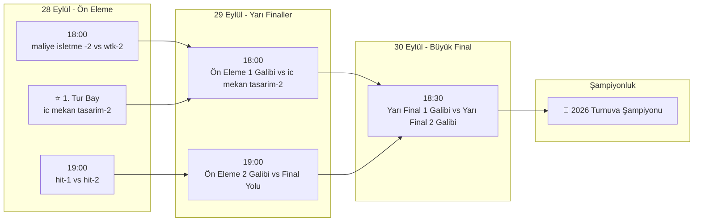

# 🏆 Futbol Turnuva Ağacı & Canlı İstatistik Yönetim Sistemi

[](https://developer.mozilla.org/en-US/docs/Web/HTML)
[](https://developer.mozilla.org/en-US/docs/Web/CSS)
[](https://developer.mozilla.org/en-US/docs/Web/JavaScript)
[](https://supabase.com)
[](https://en.wikipedia.org/wiki/Responsive_web_design)
[](https://opensource.org/licenses/MIT)

Modern, mobil uyumlu ve gerçek zamanlı (**Supabase Realtime**) senkronizasyon yeteneğine sahip web tabanlı futbol turnuva takip ve yönetim platformu.

5 takımlı eleme ağacı (**Ön Eleme**, **Yarı Final**, **Büyük Final** ve **Şampiyonluk Kürsüsü**), otomatik puan tablosu hesaplama motoru, tüm oyuncuların yer aldığı alfabetik gol krallığı, açılır/kapanır takım kadro akordeonları, popout duyuru sistemi ve sadece bilgisayardan erişilebilen güvenli yönetici paneli sunar.

---

## 📑 İçindekiler

- [Öne Çıkan Özellikler](#-öne-çıkan-özellikler)
- [Sayfa Yapısı ve Modüller](#-sayfa-yapısı-ve-modüller)
- [Takımlar ve Oyuncu Kadroları](#-takımlar-ve-oyuncu-kadroları)
- [Turnuva İşleyişi & Maç Takvimi](#-turnuva-işleyişi--maç-takvimi)
- [Yönetici Paneli (Admin Guide)](#-yönetici-paneli-admin-guide)
- [Proje Mimarisi & Dosya Yapısı](#-proje-mimarisi--dosya-yapısı)
- [Veritabanı & Supabase Kurulumu](#-veritabanı--supabase-kurulumu)
- [Kurulum & Çalıştırma](#-kurulum--çalıştırma)
- [Teknoloji Yığını](#-teknoloji-yığını)
- [Katkıda Bulunma & Lisans](#-katkıda-bulunma--lisans)

---

## ✨ Öne Çıkan Özellikler

### 🌳 1. Beş Takımlı Turnuva Ağacı (`index.html`)
- **Ön Eleme (28 Eylül):** 
  - `18:00` — `maliye isletme -2` 🆚 `wtk-2`
  - `19:00` — `hit-1` 🆚 `hit-2`
- **1. Tur Bay Takımı:** `ic mekan tasarim-2` (Kura avantajıyla doğrudan 1. Yarı Finale yükselir).
- **Yarı Finaller (29 Eylül):** Ön eleme maçlarının galipleri ile Bay takımının eşleştiği 2 yarı final mücadelesi.
- **Büyük Final (30 Eylül):** Şampiyonluk maçı ve maç sonunda kupa kazananın taçlandığı **2026 Turnuva Şampiyonu Kürsüsü**.
- **Ekran Uyumlu Bracket Tasarımı:** Ön eleme kartlarının ekran dışına taşması engellenmiş, masaüstünde tam sığan, mobilde ise akıcı dokunmatik yatay kaydırma (`smooth touch scroll`) sunan esnek düzen.

### 📊 2. İstatistikler & Kadrolar (`istatistik.html`)
- **Tek Genel Puan Durumu:** Grup ayrımı (A/B) ve kafa karıştıran maç fikstürü tıklamaları kaldırılmış; 5 takımın tamamını tek bir prestijli tabloda gösteren sıralama (`O`, `G`, `B`, `M`, `Av`, `Puan`).
- **⚡ Skorlardan Puan Tablosuna Otomatik Aktarım:** Turnuva ağacındaki maç skorlarını okuyarak puan tablosunu averaj ve galibiyet puanlarına göre (G: 3, B: 1, M: 0) tek tıkla otomatik dolduran akıllı hesaplama algoritması.
- **⚽ Bütün Oyuncuların Yer Aldığı Gol Krallığı:**
  - 5 takımdaki **34 oyuncunun tamamı** listelenir.
  - Varsayılan olarak **takımlara göre alfabetik** (`hit-1`, `hit-2`, `ic mekan tasarim-2`, `maliye isletme -2`, `wtk-2`) ve takım içi oyuncu ismine göre alfabetik sıralanır.
  - İsteğe bağlı tek tıkla `⚽ Gole Göre` veya `🔤 Takımlara Göre (A-Z)` sıralama butonları.
  - Yapışkan başlık (`sticky header`) ve iç kaydırma ile kompakt görünüm.
- **🛡️ Genişleyebilen Takım Kadroları (Akordeon):**
  - Sayfa açıldığında tüm takımlar kapalı gelir.
  - İstenen takıma tıklandığında aşağı doğru akıcı şekilde genişleyerek oyuncu isimlerini ve gol sayılarını gösterir.
  - Anlık filtreleme sağlayan oyuncu/takım arama kutusu ve tek tıkla **"📂 Tümünü Aç / 📁 Tümünü Kapat"** butonları.

### 📢 3. Duyurular & Popout Modal (`duyurular.html`)
- **Girişte Çıkan Popout Duyuru:** Site açıldığında en son duyuruyu ekrana getiren şık açılır pencere (dilenirse kapatılabilir veya tüm duyuruları oku butonuna basılabilir).
- **Kategori Filtreleme:** `🚨 Önemli`, `⚽ Maç Bilgileri`, `📜 Kurallar` ve `📢 Genel` sekmeleri.
- **Hızlı Arama & Sabitleme:** Duyuru başlığı veya içeriğine göre filtreleme, en başa sabitlenen (pinned) duyuru desteği ve tek tıkla panoya bağlantı kopyalama (`🔗 Paylaş`).

### 📱 4. Mobil Uyumluluk & Sadece Bilgisayara Özel Yönetici Paneli
- **Telefonda Sıfır Yönetici Karmaşası:** Yönetici giriş butonları, modal pencereleri ve kart düzenleme tetikleyicileri **mobil cihazlarda ve telefon ekranlarında tamamen gizlenmiştir**. Ziyaretçiler sadece temiz bir izleyici arayüzü görür.
- **Masaüstünde Güvenli Yönetim:** Bilgisayardan girildiğinde üst barda beliren `🔒 Yönetici Girişi` butonu ve PIN doğrulaması ile tam kontrol sağlanır.

### ☁️ 5. Çift Katmanlı Bulut Eşitleme (Dual-Layer Sync)
- **Supabase Realtime:** Bir yöneticinin girdiği skor, istatistik veya paylaştığı duyuru veritabanına anında yansır; sayfayı yenilemeye gerek kalmadan tüm bağlı cihazlarda canlı güncellenir.
- **Bellek İçi (In-Memory) Veri:** Tarayıcı çerezlerine veya yerel depolamaya (LocalStorage) hiçbir veri yazılmaz; tüm veriler oturum süresince bellek üzerinde güvenli ve temiz bir biçimde tutulur.

### 🌓 6. Koyu / Açık Tema (Dark & Light Mode)
- Özel HSL/Hex renk paleti ile tasarlanmış modern karanlık ve aydınlık temalar.
- Sayfa açıkken tema anlık değiştirilebilir, çerez veya yerel depolama tutulmaz.

---

## 🗂️ Sayfa Yapısı ve Modüller

| Sayfa | Açıklama |
|---|---|
| [`index.html`](file:///c:/Users/HP/Documents/Siteler/Turnuva-A-ac--main/index.html) | 5 takımlı turnuva ağacı, maç kartları, şampiyon kürsüsü ve giriş popout duyurusu |
| [`istatistik.html`](file:///c:/Users/HP/Documents/Siteler/Turnuva-A-ac--main/istatistik.html) | Tek genel puan durumu, 34 kişilik alfabetik gol krallığı ve takım kadro akordeonları |
| [`duyurular.html`](file:///c:/Users/HP/Documents/Siteler/Turnuva-A-ac--main/duyurular.html) | Duyuru listesi, filtreler, arama ve yeni duyuru ekleme/düzenleme/silme arayüzü |

---

## 🛡️ Takımlar ve Oyuncu Kadroları

Turnuvada toplam **5 takım** ve **34 lisanslı oyuncu** mücadele etmektedir:

```
├── hit-1 (8 Oyuncu)
│   └── arda, baris, bilal, can, davut, enes, semih, tunc
├── hit-2 (8 Oyuncu)
│   └── aykut, cakir, gazi, ibo, mahmut, mertcan, sazak, tamer
├── ic mekan tasarim-2 (4 Oyuncu)
│   └── ahmethan, enes, sadik, samet
├── maliye isletme -2 (9 Oyuncu)
│   └── burak, burak kus, emir, emirhan, enes, mert, toprak, umut, yigit
└── wtk-2 (8 Oyuncu)
    └── ali, alpi, goktug, mehmet, mehmet acar, muhammet, oguzhan, serhat
```

---

## 📅 Turnuva İşleyişi & Maç Takvimi



---

## 🔐 Yönetici Paneli (Admin Guide)

> [!IMPORTANT]
> Yönetici paneli butonları telefon ekranlarında güvenlik ve kullanım kolaylığı amacıyla **gizlenmiştir**. Yönetim işlemleri için siteye **bilgisayar (masaüstü / dizüstü)** üzerinden giriş yapınız.

1. **Giriş:** Üst barda yer alan `🔒 Yönetici Girişi` butonuna tıklayın.
2. **Doğrulama:** Açılan pencerede yönetici şifresini girin.
3. **Turnuva Ağacı Yönetimi (`index.html`):**
   - Ön eleme, yarı final ve final maçlarının skorlarını girin.
   - Durumunu `Bekleniyor`, `🔴 Canlı` veya `✅ Tamamlandı` olarak belirleyin.
   - Kazananı seçerek bir sonraki tura aktarın.
   - **⚡ Skorları Puan Tablosuna Aktar:** Bu butona basıldığında maç skorları otomatik olarak okunur ve puan durumu veritabanına işlenir.
4. **İstatistik Yönetimi (`istatistik.html`):**
   - Puan tablosunu manuel olarak düzenleyin veya `⚡ Ağaç Skorlarından Doldur` butonuyla otomatik hesaplatın.
   - Oyuncuların attıkları gol sayılarını güncelleyin.
5. **Duyuru Yönetimi (`duyurular.html`):**
   - Yeni duyuru oluşturun, kategorisini ve tarihini belirleyin.
   - İstediğiniz duyuruyu en başa sabitleyin (`📌 Pinned`).
   - Mevcut duyuruları düzenleyin veya silin.

---

## 📁 Proje Mimarisi & Dosya Yapısı

```
Turnuva-A-ac--main/
│
├── index.html              # Ana sayfa: 5 takımlı turnuva ağacı ve popout duyuru modalı
├── istatistik.html         # İstatistikler: Tek puan durumu, gol krallığı, takım akordeonları
├── duyurular.html          # Duyuru haber merkezi ve filtreleme sayfası
│
├── fikstur.js              # Turnuva ağacı verileri, skorları ve Supabase senkronizasyonu
├── istatistik.js           # Puan tablosu hesaplama motoru, kadrolar ve gol krallığı modülü
├── duyurular.js            # Duyuru CRUD fonksiyonları ve bulut eşitleme katmanı
├── supabase-config.js      # Supabase URL, Anon Key ve bağlantı istemcisi
│
├── supabase_schema.sql     # Supabase SQL veritabanı şeması, RLS politikaları ve Realtime
├── logo.jpeg               # Turnuva logosu / favicon
└── README.md               # Proje belgelendirmesi
```

---

## 🗄️ Veritabanı & Supabase Kurulumu

Proje, canlı veri akışı için **Supabase (PostgreSQL + Realtime)** altyapısını kullanır. Kendi Supabase projenizi bağlamak için:

1. [Supabase](https://supabase.com) üzerinde ücretsiz bir proje oluşturun.
2. Sol menüden **SQL Editor** bölümüne gidin.
3. Projedeki [`supabase_schema.sql`](file:///c:/Users/HP/Documents/Siteler/Turnuva-A-ac--main/supabase_schema.sql) dosyasının içeriğini kopyalayıp editöre yapıştırın ve **Run** butonuna basın.
4. Bu işlem:
   - `public.duyurular` (Duyurular tablosu)
   - `public.turnuva_fikstur` (Turnuva ağacı JSON tablosu)
   - `public.turnuva_istatistik` (Puan ve oyuncu JSON tablosu)
   tablolarını oluşturur, **Row Level Security (RLS)** izinlerini ve **Realtime** yayınını açar.
5. Supabase panelinden aldığınız **Project URL** ve **Anon Key** bilgilerini [`supabase-config.js`](file:///c:/Users/HP/Documents/Siteler/Turnuva-A-ac--main/supabase-config.js) dosyasına tanımlayın:

```javascript
const SUPABASE_URL = 'https://YOUR_PROJECT_ID.supabase.co';
const SUPABASE_ANON_KEY = 'YOUR_SUPABASE_ANON_KEY';
```

---

## 🚀 Kurulum & Çalıştırma

Proje saf HTML, Vanilla CSS ve modern JavaScript ile yazılmıştır; derleme (build) veya ağır bağımlılık yüklemeleri gerektirmez.

### Seçenek 1: VS Code Live Server ile
1. Proje klasörünü **VS Code** ile açın.
2. `index.html` dosyasına sağ tıklayıp **"Open with Live Server"** seçeneğine basın.

### Seçenek 2: Node.js ile Yerel Sunucu
```bash
# http-server ile çalıştırma
npx http-server ./ -p 8080 -c-1

# veya serve ile
npx serve ./
```
Tarayıcınızdan `http://localhost:8080` adresine gidin.

### Seçenek 3: GitHub Pages / Vercel / Netlify
- Projeyi GitHub reponuza push edin.
- **GitHub Pages:** `Settings > Pages > Branch: main` seçerek anında yayınlayabilirsiniz.
- **Vercel / Netlify:** Statik site olarak doğrudan deploy edilebilir.

---

## 🛠️ Teknoloji Yığını

- **Frontend:** HTML5, Semantik Etiketler, CSS3 (Modern Flexbox, CSS Grid, Glassmorphism, CSS Değişkenleri), Vanilla JavaScript (ES6+).
- **Yazı Tipi:** [Plus Jakarta Sans](https://fonts.google.com/specimen/Plus+Jakarta+Sans) (Google Fonts).
- **Veritabanı & Canlı Yayın:** [Supabase](https://supabase.com) (PostgreSQL, Row Level Security, Realtime WebSockets).
- **Bellek Yönetimi:** In-Memory JavaScript State (Tarayıcı çerezleri veya LocalStorage'a hiçbir veri kaydedilmez).
- **Tasarım:** Tamamen responsive (Masaüstü, tablet ve mobil uyumlu).

---

## 👨‍💻 Yapımcı & Lisans

Bu proje **Arda Utancak** tarafından geliştirilmiştir.

Bu proje [MIT Lisansı](LICENSE) kapsamında lisanslanmıştır. Özgürce kullanılabilir, geliştirilebilir ve dağıtılabilir.